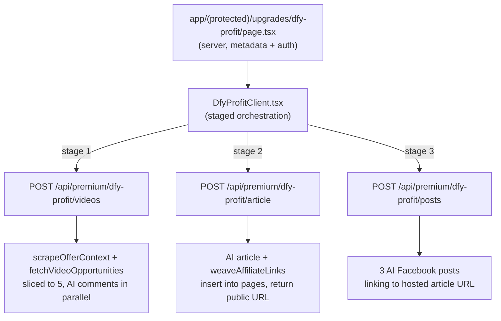

# Done-For-You Profit — Design Spec

**Date:** 2026-09-08
**Route:** `/upgrades/dfy-profit`
**User-facing name:** Done-For-You Profit
**Registry key:** `dfyProfit`
**Tier:** Premium page (not a purchasable `upgrade_level` tier)

## Goal

One-run generation of a complete promo kit from an affiliate link plus a niche:

1. 5 videos to comment on, each with AI-written comments
2. A publicly hosted authority article with the affiliate link woven in
3. Exactly 3 Facebook posts promoting the hosted article

Modeled on the sibling app's `dfy-profit` feature (`D:\Apps\blackboxcash\src\features\dfy-profit`),
with the sales-page stage replaced by video discovery, which is this app's product.

## Non-goals

- X story thread (exists in blackbox, deliberately excluded)
- Sales-page templates / `sites` system (does not exist in this app)
- Editing generated assets in place
- Any paywall, gating, or purchasable tier
- New Supabase tables or migrations

## Entitlement model

Done-For-You Profit is a **premium page only**, exactly like Cyber Protection: it appears in
`PREMIUM_FEATURES` and is reachable by any authenticated, onboarded user.

It is **not** added to `users.upgrade_level`. The CHECK constraint in
`scripts/001_create_schema.sql` line 9 stays as-is (`free`, `dfy_vault`, `instant_income`,
`automated_income`), there is no `/unlock/dfy-profit` route, and `app/actions/unlock-upgrade.ts`
is untouched. This matches the current reality that no upgrade route is gated at runtime.

## Architecture

A server page renders a client component that orchestrates three sequential API routes. Each
route is independently retryable and carries its own `maxDuration = 120`, which is why these are
route handlers rather than server actions.

### Stage sequencing and failure isolation

Stage 1 is blocking: if it fails, the run aborts and the form shows the error, because stages 2
and 3 need its product context. Stages 2 and 3 fail soft — an error in one records a
section-scoped error plus a retry button and the run proceeds. This mirrors
`DfyProfitPage.handleGenerate` in blackbox.

## New module: `lib/dfy-profit/`

| File | Responsibility |
|---|---|
| `ai.ts` | `generateStructuredJSON` / `generateWithGPT` over the RapidAPI `gpt4o` endpoint, with retries and JSON repair |
| `prompts.ts` | Article system + user prompts, `normalizeArticleContent`, Facebook post prompt |
| `article-fallback.ts` | Template authority article for when AI is unavailable |
| `posts-fallback.ts` | Self-contained niche-keyed Facebook post templates |
| `generate-video-comments.ts` | Non-persisting AI comment generation for a single video |
| `scrape-offer-context.ts` | Fetch the affiliate URL, extract `<title>` + meta description |
| `weave-affiliate-links.ts` | Inject `a.affiliate-link` anchors plus a footer CTA into article HTML |
| `types.ts` | `DfyVideoResult`, `DfyArticleResult`, `DfyFacebookPost`, stage types |

`ai.ts` is ported from `D:\Apps\blackboxcash\src\features\blog-builder\lib\ai.ts` and adapted to
the request shape this app already uses in `app/actions/generate-viral-comments.ts` lines 61–76
(`https://${RAPIDAPI_HOST}/gpt4o`, headers `x-rapidapi-key` / `x-rapidapi-host`, body
`{ messages, web_access: false }`). Env vars are the existing `RAPIDAPI_KEY` and `RAPIDAPI_HOST`;
no new env vars.

`prompts.ts` ports `ARTICLE_SYSTEM_PROMPT`, `buildArticleUserPrompt`, and
`normalizeArticleContent` from blackbox's `blog-builder/lib/prompts.ts`, keeping the authority-tier
validation of `minWords: 1000` and `requireFaq: true`.

## Stage 1 — videos

**Route:** `POST /api/premium/dfy-profit/videos`
**Request:** `{ affiliateUrl: string, niche: string, offerName?: string }`
**Response:** `{ productName, productContext, niche, videos: DfyVideoResult[] }`

1. Validate `affiliateUrl` with the existing `isValidAffiliateUrl`, and require a niche.
2. Derive product context. If `offerName` is supplied (the user picked a saved link via
   `SavedLinksPicker`, which carries `affiliate_links.offer_name`), use it directly. Otherwise call
   `scrapeOfferContext(affiliateUrl)` with an 8s timeout, falling back to a hostname-derived name.
3. Call the existing `fetchVideoOpportunities({ productName, productDescription, keyword: niche, mode: "niche" })`
   and slice to exactly 5 results.
4. Generate comments for all 5 videos **in parallel** via `Promise.allSettled`. Parallelism is
   required: 5 sequential AI calls would approach the 120s ceiling. Any individual video that fails
   falls back to template comments, so a video card is never empty.

The existing `generateViralCommentsAction` cannot be called directly, because it persists a `pages`
row per invocation. Its AI comment generation and template fallback are extracted into
`lib/dfy-profit/generate-video-comments.ts` as a pure, non-persisting function, and the existing
action is refactored to call that same function so its behavior — including its `pages` insert —
stays identical. This keeps one implementation of comment generation rather than a second copy.

Comments are returned inline for copying and are **not** persisted. Gold Rush saves one `pages` row
per video, which would insert 5 rows into My Vault on every run; the article is the persisted asset.

## Stage 2 — authority article

**Route:** `POST /api/premium/dfy-profit/article`
**Request:** `{ affiliateUrl, productName, productContext, niche }`
**Response:** `{ id, slug, url, title, excerpt, html, saveWarning? }`

1. Generate the article via `lib/dfy-profit/ai.ts` at authority tier. On failure or missing
   `RAPIDAPI_KEY`, fall back to `article-fallback.ts`.
2. Weave affiliate links into the HTML with `weaveAffiliateLinks`, emitting
   `<a class="affiliate-link" href="{affiliateUrl}">` anchors and a footer CTA. The class matters:
   `app/article/[slug]/article-content.tsx` line 39 already binds click tracking to
   `a.affiliate-link` and posts to `/api/track-click`.
3. Persist to `pages`: `title`, `content` (the HTML), `affiliate_link`, `offer_name: productName`,
   `slug`, `status: 'active'`, `offer_id: null`.
4. Satisfy the `niche_id NOT NULL` constraint using the get-or-create "General" niche pattern
   already in `app/actions/generate-viral-comments.ts` lines 184–195. No migration is needed.
5. Return the public URL. If the insert fails, still return the generated HTML with a
   `saveWarning` so the kit UI is not empty — the same concession blackbox makes in its
   `article/route.ts` lines 66–80.

Slug generation: slugify the title, append a short random suffix, and retry once on unique-constraint
collision, since `pages.slug` is `UNIQUE` per `scripts/005_add_slug_and_public_access.sql`.

### Public rendering

Two changes to `app/article/[slug]/page.tsx`:

- **Lookup:** query by `slug` first, then fall back to `id`. Existing links are UUID-based, so this
  preserves them.
- **Render branch:** if `content` parses as JSON with a `comments` array, render `CommentPackViewer`
  exactly as today. Otherwise treat `content` as HTML and render `ArticleContent`, which is
  currently present but never imported. Today the route calls `notFound()` when the JSON parse
  fails (lines 44–46), so this branch replaces a dead end and leaves every existing comment pack
  working unchanged.
- **Select list:** the query currently selects `id, title, content, affiliate_link, status`, but
  `ArticleContent` also reads `views` and `created_at` (and optional `niches` / `offers` joins), so
  `views, created_at` are added to the select. The optional joins are left absent; the component
  already treats them as optional.

Public read access already exists via the `"Anyone can view active pages"` policy in
`scripts/005_add_slug_and_public_access.sql`.

## Stage 3 — Facebook posts

**Route:** `POST /api/premium/dfy-profit/posts`
**Request:** `{ affiliateUrl: string, articleUrl?: string, productName: string, niche: string }`
**Response:** `{ posts: DfyFacebookPost[], promoLink: string, usedFallbackLink: boolean }`

The promo link is `articleUrl` when stage 2 succeeded, otherwise `affiliateUrl`. Posts promote the
hosted article rather than the raw affiliate URL so clicks are tracked, the same choice blackbox
makes in its `posts/route.ts` where `promoLink` is the hosted offer page. When stage 2 failed there
is no hosted URL, so the route falls back to the raw affiliate URL and returns
`usedFallbackLink: true`, which the UI surfaces as a note.

Generate exactly 3 niche-aware posts promoting `promoLink`. If AI fails, fall back to 3 templates
from `lib/dfy-profit/posts-fallback.ts`, substituting `[LINK]` with `promoLink`.

The fallback templates are a self-contained niche-keyed map inside `posts-fallback.ts`, seeded from
the copy in `app/(protected)/upgrades/instant-income/instant-income-content.tsx`. They are not
imported from that file: it is a `"use client"` component holding `facebookPosts[]` as a local
array, so it cannot be consumed by a route handler. Instant Income is left untouched.

## UI

Follows this app's conventions rather than blackbox's, per `DESIGN_SYSTEM.md`:

- `app/(protected)/upgrades/dfy-profit/page.tsx` — server component, auth check, `metadata`
- `DfyProfitClient.tsx` — `max-w-7xl mx-auto`, opens with `PageHeader`
  (eyebrow "Premium", title "Done-For-You Profit")
- Marketing typography is inherited from `app/(protected)/upgrades/layout.tsx`; no local layout needed
- Inputs: affiliate link field with `SavedLinksPicker`, then niche pills
- `GenerationProgress` with `offer="welcome"` while generating, so the Q-LAPS `WelcomeOfferBanner`
  shows — `DESIGN_SYSTEM.md` section 7 requires premium pages use `WelcomeOfferBanner`, not
  `EarningsBanner`. Stage-specific labels: "Finding your videos…", "Writing your authority
  article…", "Generating Facebook posts…"
- `DfyResultPanel.tsx` — three sections (videos, article, Facebook posts), each with copy buttons
  and a section-scoped error plus retry, modeled on blackbox's `DfyResultPanel`
- Sapphire tokens only; no gold outside the `EarningsBanner` exception

No `PremiumVideoTutorial` on this page: `lib/premium-training-videos.ts` has Vimeo IDs for only the
four existing features, and no video exists for this one. The slot can be added later without
structural change.

## Registry and navigation

Adding entries to `lib/premium-features.ts` propagates automatically to `components/app-sidebar.tsx`,
`components/bottom-nav.tsx`, and `components/premium-upgrades-widget.tsx`, all of which map over
`PREMIUM_FEATURES`:

- `PREMIUM_FEATURE_LABELS.dfyProfit = "Done-For-You Profit"`
- A `PREMIUM_FEATURES` entry: `href: "/upgrades/dfy-profit"`, the label, a one-line description, and
  a lucide icon distinct from the existing `Gem` / `Sparkles` / `Zap` / `ShieldCheck`

`app/(protected)/upgrades/page.tsx` keeps its own duplicate `upgrades[]` array, so it needs a 5th
card added and its grid changed from `xl:grid-cols-4` to `xl:grid-cols-5` (line 107).

`UPGRADE_LEVEL_LABELS` and the `UpgradeLevel` type are **not** modified.

## Error handling

| Failure | Behavior |
|---|---|
| Invalid affiliate URL or no niche | Inline form validation, no request sent |
| Not authenticated | Every route returns 401 via `supabase.auth.getUser()` |
| Affiliate URL scrape fails or times out | Fall back to hostname-derived product name, continue |
| Stage 1 fails | Abort run, show form-level error, offer retry |
| Per-video comment generation fails | That video falls back to template comments |
| Article AI fails or no `RAPIDAPI_KEY` | Template article from `article-fallback.ts` |
| Article insert fails | Return HTML with `saveWarning`; copy still works, no hosted URL |
| Facebook AI fails | Template posts from the existing niche pool |
| Stage 2 or 3 fails | Section error plus retry button; other sections keep their results |

## Testing

- Unit: `normalizeArticleContent` (min word count, FAQ requirement), slug generation,
  `weaveAffiliateLinks` (anchor class and count, footer CTA, idempotence),
  `scrapeOfferContext` fallback name derivation and meta parsing
- The slug collision retry lives in the stage 2 route rather than a pure function, so it is
  verified manually by generating two kits from the same offer and confirming both persist
- Unit: the `/article/[slug]` render branch — a comment-pack JSON row still yields
  `CommentPackViewer`, an HTML row yields `ArticleContent`, a missing row still 404s
- Manual: full run with `RAPIDAPI_KEY` set, and a full run with it unset to confirm every fallback
  path produces a usable kit
- Manual: confirm an existing `/article/{uuid}` comment-pack link still renders after the lookup
  change
- Manual: the new card appears in the sidebar, mobile More sheet, dashboard widget, and the
  `/upgrades` grid at 5 columns
